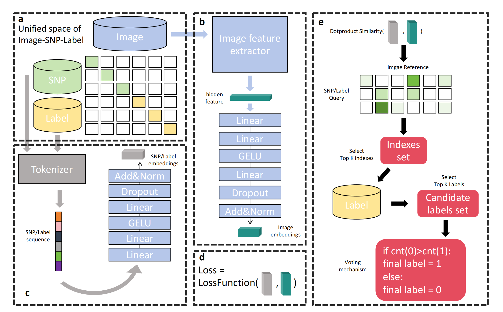

# BrainCLIP

This code is prepared for "brain clip".

## Overview

### Abstract




## Installation
Download Antiformer:
```git clone https://github.com/wq2581/Antiformer```

Install Environment:
```pip install -r requirements.txt``` or ```conda env create -f environment.yml```

Our code is all based on python. In order to install dependencies please enter the project path ```./AntiFormer``` and activate your python environment.


## Running

### Train from scratch
   The codes for dataset creating are stored in the ```./AntiFormer/data``` directory. If you want to train from scratch, you need to start with data processing.
   
   (1) Ddownload the required data.
   ```bash
   $ cd /path/to/data
   $ python data_download.py
   ```
   
   (2) Get the frequency statistics. Of course, we also provide the results of frequency statistics saved as txt files in this directory.
   ```bash
   $ cd /path/to/data
   $ python data_process.py
   ```
   (3) Build the dataset.
   ```bash
   $ cd /path/to/data
   $ python dataset_making.py
   ```
   
   (4) Tokenize the input sequence
   ```bash
   $ cd /path/to/data
   $ python dt_rebuild.py
   ```
   
   (5) Run AntiFormer and get the prediction results.
   ```bash
   $ cd /path/to/AntiFormer
   $ python main.py
   ```
   
### From pre-trained model

   We also provide partially processed data (2000 sequences) as demo, located under the ```./AntiFormer/subdt``` path. And the pre-trained model can be accessed from [google drive](https://drive.google.com/file/d/1D-mkFwoJzu7E__vJc3ahnFE4UVGYz4_Q/view?usp=sharing). Please download the model and put it into ```./AntiFormer/model_save``` directory.
   However，if you have processed all the data, you can replace the ```./subdt``` path with your data path for training by . And be careful to change the hyperparameters in the ```main.py``` to suit your hardware and target.


## Quick start

If you want to use our model, you can download the pre-trained model from [google drive](https://drive.google.com/file/d/1D-mkFwoJzu7E__vJc3ahnFE4UVGYz4_Q/view?usp=sharing) and quickly test it using the antiboy sequence provided by the tutorial.

   
